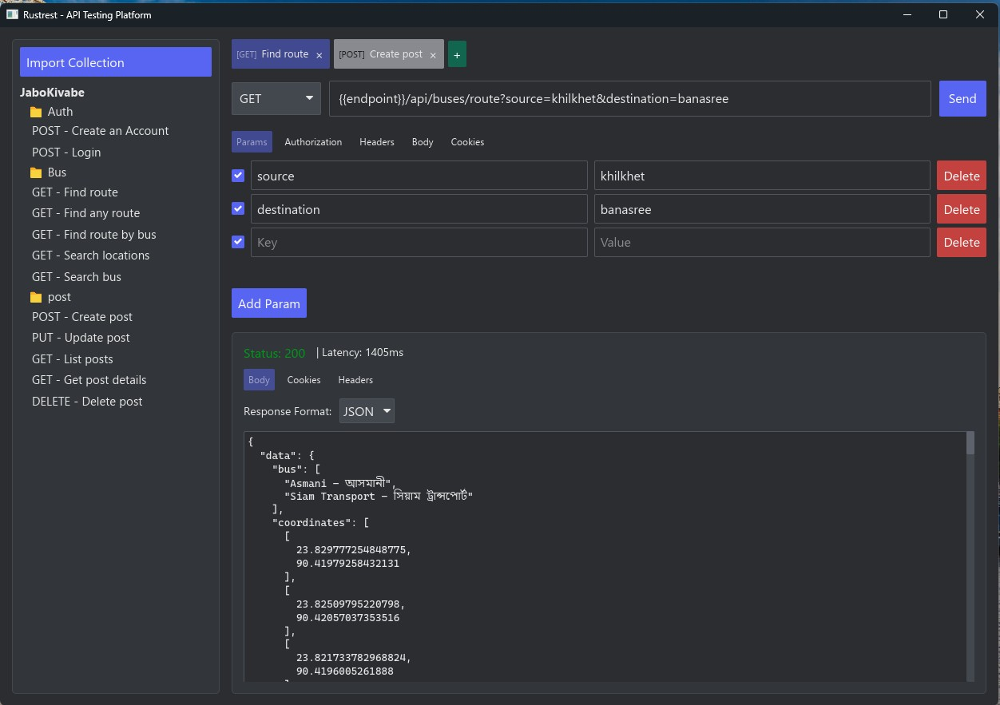

## Description
Rustrest is a native API testing platform written in Rust.

## Screenshot

## TODO
- [ ] websocket support
- [ ] streaming sse support
- [ ] collaboration
- [ ] add more auth types
- [ ] collection of requests with saved responses
- [x] import collections postman (v2.1)
- [ ] add support for insomnia (v4, v5.1)
- [ ] add support for open api
- [ ] add support for swagger
- [x] collection view sidebar
- [x] supports Postman v2.1 JSON file
- [ ] export collections
- [ ] environment variables
- [ ] docs generation
- [x] request cancellation
- [ ] Request section
  - [x] params to update url and vice versa
  - [x] add cookies
  - [x] custom request method
  - [x] add request method type indicator in request tab
  - [x] rename request tab
  - [x] form data type text and file
  - [x] request body binary data: file upload
  - [ ] add basic Auth
- [ ] Response section
  - [x] add json view in body response
  - [ ] json view highlighting
  - [ ] add different views in body response
  - [ ] add preview in body response
  - [x] add response pages (cookies, headers, )
  - [ ] show response time breakdown
  - [ ] show response size
  - [ ] show response network info including ssl
  - [ ] add wrap lines, filter, search, copy in body response
  - [ ] add context menu with copy
- [ ] Settings
  - [ ] general settings 
    - [ ] http version, request timeout, max response size, ssl certificate verification, disable cookies
    - [ ] editor settings (font family, font size)
    - [ ] theme settings
    - [ ] update
