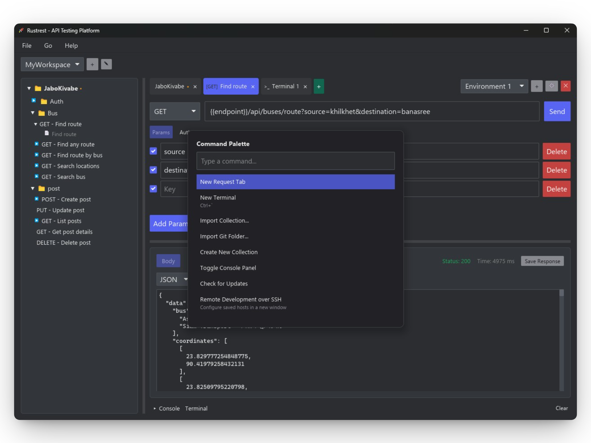

## Rustrest API Testing Platform
Rustrest is an open-source, cross-platform native API testing platform written in Rust.

Rustrest is native, with fastest boot times. It consumes less memory and CPU resources than any other API testing platform out there.

Rustrest stores your collections directly on your local filesystem. It supports Postman compatible JSON collections.

You can use Git or any version control system to manage your collections.

## Why Rustrest?
Modern API clients like Postman or Insomnia carry massive resource overhead. Rustrest is designed for developers who prefer speed and simplicity:

- **Zero Bloat**: Built natively without heavy web-browser runtimes.
- **Resource Efficient**: Low memory footprint and instant startup times.
- **Focused**: Just what you need to test APIs, nothing you don't.

[Download Rustrest](https://github.com/SojebSikder/rustrest/releases)

## Features
- Native, Lightweight, and instant startup time.
- **Fast**: Send request and get responses in real time.
- **HTTP Methods**: GET, POST, PUT, DELETE, PATCH, HEAD, OPTIONS and CUSTOM
- **Test APIs** using test suites
- **Local Vault**: Local storage for collections and other resources
- **Git-native**: Collaborate via Git or any other version control system
- And many more...
